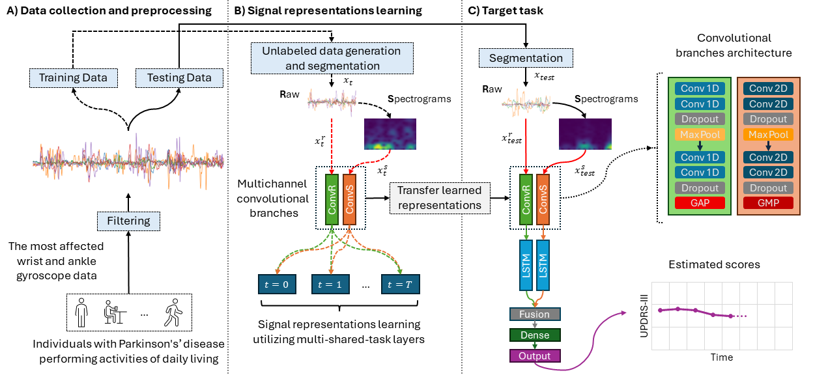
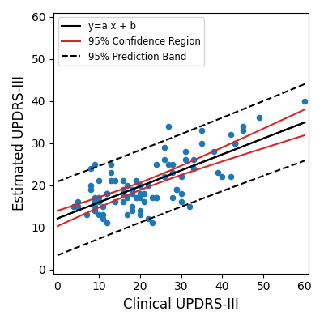
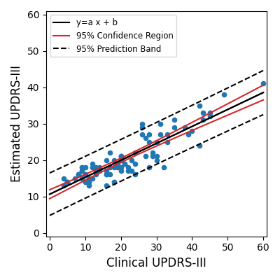

# Multi-shared-task Self-supervised (M-SSL) Multichannel CNN-LSTM

This code is for the proposed Multi-shared-task Self-supervised CNN-LSTM network to estimate UPDRS-III scores of PD patients.
The MDPI Bioengineering journal has recently published the research associated with this code.
Multi-Shared-Task Self-Supervised CNN-LSTM for Monitoring Free-Body Movement UPDRS-III Using Wearable Sensors: https://doi.org/10.3390/bioengineering11070689

## M-SSL Multichannel CNN-LSTM for UPDRS-III Estimation in PD Patients

**Figure 1.** The main algorithm for estimating UPDRS-III scores.

	
**Figure 2.** The correlation of the Supervised (left) and the proposed M-SSL (right) Multichannel CNN-LSTM.

## General Note
- The code treats the estimation of UPDRS-III scores as a regression problem. If you want to use the model as a classifier, you need to alter the model's output layer and loss function.
- The code performs a leave-one-out subject-wise testing. You can replace the folds with the desired training and testing data. 
- The original data is not available due to privacy concerns.

## Code Requirements and Compatability
The code was run and tested using the following:
- Python		3.10.11
- tensorflow	2.10.1
- keras			2.10.0
- h5py			3.10.0
- matplotlib	3.9.0
- numpy			1.26.3
- pandas		2.1.4
- scikit-learn	1.5.0
- scipy			1.13.1
- transforms3d	0.4.1

## Formating Your Own Data
If you want to use your data, consider the following:
- The shape of the input should be (n, 6), where n is the number of samples.
- The six columns are Gyroscope Wrist X, Y, Z and Ankle X, Y, Z.
- The labels are to be shaped as (n, 1).
- Modify 'data_generate_raw.py', 'data_generate_spectrogram.py', 'data_pretext_generate_raw.py', and 'data_pretext_generate_spectrogram.py' to remove any dependancy on orginal data.

## Running the Model
- Run 'data_generate_raw.py' and 'data_generate_spectrogram.py' to segment the Gyroscope Raw data and generate Spectrograms.
- Pretext Task: run 'task_pretext_multitask_dual.py' to pre-train the Multichannel CNN using the proposed Multi-shared-task Self-supervised Learning (M-SSL) approach.
- The code will generate the selected signal transformations and their spectrograms for the Pretext task.
- The pre-trained models will be saved in the 'models' folder
- Downstream Task: Run 'task_downstream_dual_cnn_lstm.py' to transfer the weights from the pre-trained models, fine-tune them and evaluate the testing data.
- Baseline task: run 'task_baseline_dual_cnn_lstm.py' to get the model performance in a Supervised scenario (not using M-SSL).
- Use any of the analysis codes to calculate metrics and visualize outputs.

## Conclusion